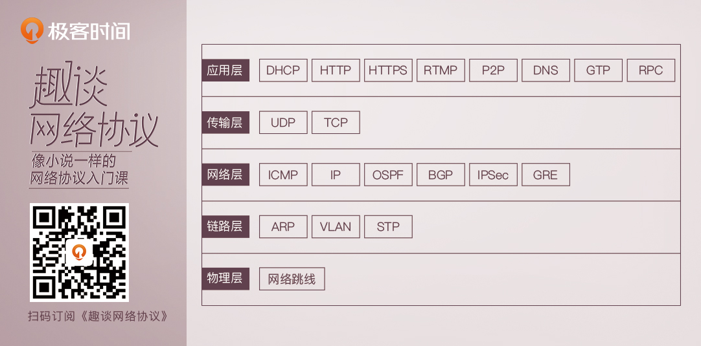
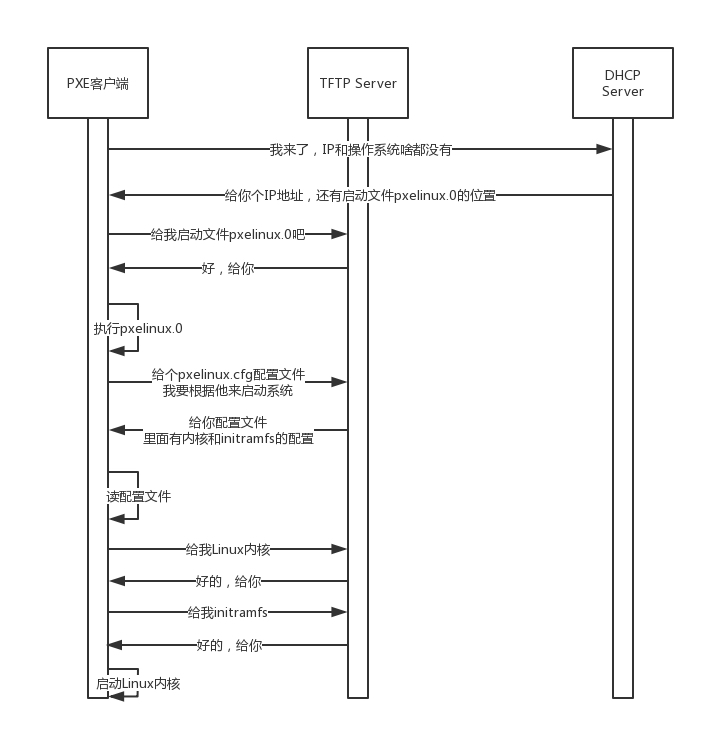

##  网络协议


### ifconfig ，ip addr 两种查看ip的方式的区别？（linux下）
net-tools起源于BSD，自2001年起，Linux社区已经对其停止维护，而iproute2旨在取代net-tools，并提供了一些新功能。一些Linux发行版已经停止支持net-tools，只支持iproute2。

### ip地址，mac地址的区别？
1. IP 地址是一个网卡在网络世界的通讯地址，相当于我们现实世界的门牌号码。  
2. MAC 地址更像是身份证，是一个唯一的标识。  
3. IP 是地址，有定位功能；MAC 是身份证，无定位功能；
```shell
    en0: flags=8863<UP,BROADCAST,SMART,RUNNING,SIMPLEX,MULTICAST> mtu 1500
            ether f0:18:98:69:ed:b9
            inet6 fe80::10fa:ea68:ea89:8df7/64 secured scopeid 0xb
            inet 192.168.199.175/24 brd 192.168.199.255 en0
```

### ip
1. ip一开始32位，不够用。所以出现ipv6；  
2. 共有ip和私有ip？  
公有 IP 地址有个组织统一分配，你需要去买。但是假如你要做一个个人网站，就需要有公有ip，全世界才可以访问；  
平时我们看到的数据中心里，办公室、家里或学校的 IP 地址，一般都是私有 IP 地址段。因为这些地址允许组织内部的 IT人员自己管理、自己分配，而且可以重复。因此，你学校的某个私有 IP 地址段和我学校的可以是一样的。  
这就像每个小区有自己的楼编号和门牌号，你们小区可以叫 6 栋，我们小区也可以叫6栋；但是一旦出了小区，就需要使用公有 IP 地址；  
3. 无类型域间选路（CIDR）？  
inet 192.168.199.175/24  ：斜杠后面有个数字24。这种地址表示形式，就是 CIDR。  
后面 24 的意思是，32 位中，前 24 位是网络号，后8位是主机号。

### 如何配置 IP 地址？
使用 net-tools：
```shell
    $ sudo ifconfig eth1 10.0.0.1/24
    $ sudo ifconfig eth1 up
```
使用iproute2
```shell
    $ sudo ip addr add 10.0.0.1/24 dev eth1
    $ sudo ip link set up eth1
```
### 从IP地址 16.158.23.6,发包到ip地址 192.168.1.2为什么发不过去？
1. 因为mac层还没有填；
2. Linux 首先会判断，要去的这个地址和我是一个网段的吗，或者和我的一个网卡是同一网段的吗？只有是一个网段的，它才会发送 ARP 请求，获取 MAC 地址；
3. Linux 默认的逻辑是，如果这是一个跨网段的调用，它便不会直接将包发送到网络上，而是企图将包发送到网关；
4. 如果你配置了网关的话，Linux 会获取网关的 MAC 地址,然后将包发送出去。如果没有配置网关，那包压根就发不出去；
5. 网关要和当前的网络至少一个网卡是同一个网段的，否则linux不会让你配置成功的；

### 动态主机配置协议（DHCP）
1. 自动帮你配置ip的协议；
2. 如果是数据中心里面的服务器，IP 一旦配置好，基本不会变，这就相当于自己买房装修；
3. DHCP 的方式就相当于租房。你不用装修，都是帮你配置好的。你暂时用一下，用完退租就可以了。

### IP 地址的收回和续租
客户机会在租期过去 50% 的时候，直接向为其提供 IP 地址的 DHCP Server 发送 DHCP request消息包。客户机接收到该服务器回应的 DHCP ACK 消息包。会根据包中所提供的新的租期以及其他已经更新的 TCP/IP 参数，更新自己的配置。这样，IP 租用更新就完成了。

### 预启动执行环境（PXE）（Pre-boot Execution Environment)
1. 网络管理员不仅能自动分配 IP 地址，还能帮你自动安装操作系统。
2. 首先，启动 PXE 客户端。第一步是通过 DHCP 协议告诉DHCP Server，我刚来，一穷二白，啥都没有。DHCP便租给它一个 IP 地址，同时也给它 PXE 服务器的地址、、启动文件 pxelinux.0。
3. 这样 PXE 客户端启动之后，发送 DHCP 请求之后，除了能得到一个 IP 地址，还可以知道 PXE 服务器在哪里，也可以知道如何从 PXE 服务器上下载某个文件，去初始化操作系统。
4. DHCP 协议能给客户推荐“装修队”PXE，能够安装操作系统，这个在云计算领域大有用处。


### 如何在宿舍里自己组网玩联机游戏？
1. 不用wifi，电脑连电脑的网线，配置同域ip，就构成了一个最小的*局域网*，即*LAN*。

###  MAC层，链路层
1. MAC 层是用来解决多路访问的堵车问题的；
2. ARP 是通过吼的方式来寻找目标 MAC 地址的，吼完之后记住一段时间，这个叫作缓存；
3. 交换机是有 MAC 地址学习能力的，学完了它就知道谁在哪儿了,不用广播了。
4. 当交换机的数目越来越多的时候，会遭遇环路问题，让网络包迷路，这就需要使用 STP 协议，将有环路的图变成没有环路的树，从而解决环路问题。
5. 交换机数目多会面临隔离问题，可以通过 VLAN 形成虚拟局域网，从而解决广播问题和安全问题。


